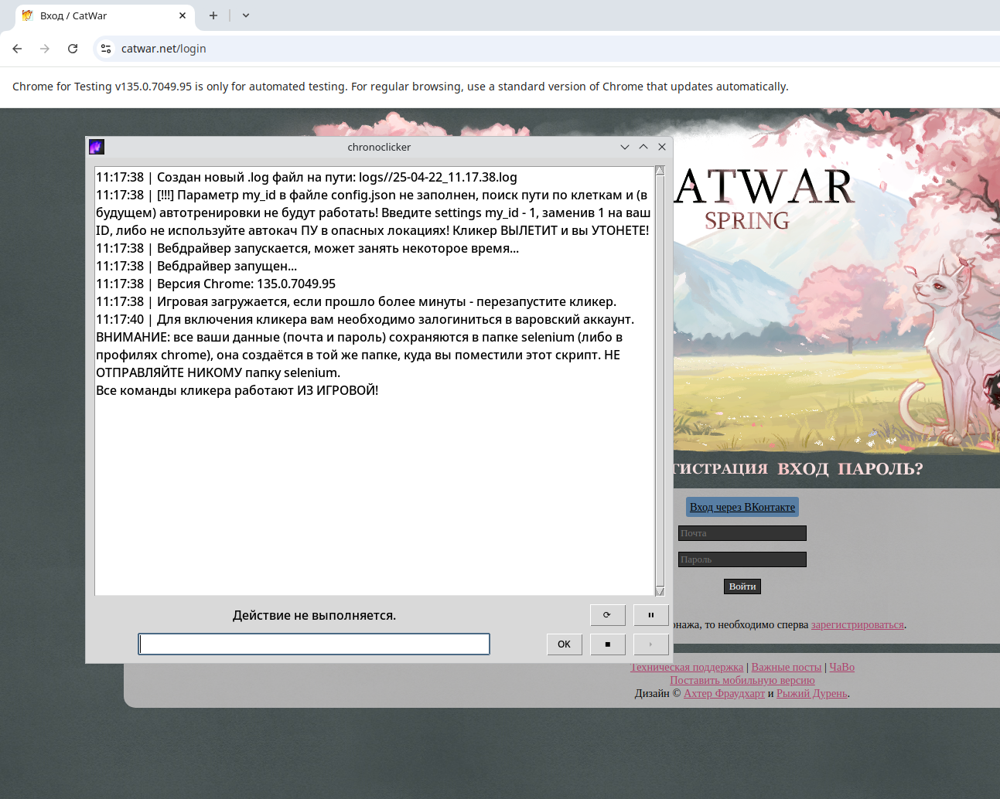

# chronoclicker
Chronoclicker - это автокликер для вара, использующий в основном Selenium WebDriver. На данный момент (v2.3) кликер умеет: качать активность, УН, КУ, ПУ, т. е. ходить по локациям по маршруту и выполнять любые действия (в том числе с другими игроками). Также умеет играть в числа с Лапом, искать предметы (включая звёздную пыль), искать котов (включая ботов СЛ), закапывать предметы, писать в чат, искать путь от клетки до клетки и прочее.
####
С версии 1.4 можно программировать! С версии 2.1 появился интерфейс!
#####
github: https://github.com/YaraRishar/chronoclicker
####
vk: https://vk.com/chronoclicker
####
**НИГДЕ БОЛЬШЕ** кликер не выкладывается.
####
Также есть отдельная программа, умеющая только играть в числа с Лапом (работает без комманд, у меня поставлена на автозапуск). Ссылка на репозиторий: https://github.com/YaraRishar/chronominer
## Описание работы кликера
При запуске кликер открывает вебдрайвер - отдельный браузер (в данном случае Chrome For Testing), в котором открывается только вкладка Игровой. Если вы запустили кликер в первый раз, то спустя 5-30 секунд ожидания вы увидите страницу входа на catwar и окно интерфейса. **Важно:** данные, которые вы использовали для входа на вар, сохраняются на вашем компьютере. Местонахождение этих данных зависит от операционной системы, например, на всех Linux они хранятся в папке selenium. Она создаётся при запуске вебдрайвера там же, где лежит приложение. На всякий случай **НЕ ПЕРЕСЫЛАЙТЕ НИКОМУ ПАПКУ SELENIUM!** Если вы хотите поделиться с кем-то кликером, то скиньте им ссылку на гитхаб/паблик вк (см. первый абзац), где можно скачать "чистую" версию.
Вебдрайвер контролируется командами из приложения chronoclicker.exe:
Если вы видите надпись "Загружается...", но вебдрайвер не открывается даже спустя несколько минут ожидания, напишите в ЛС паблика.
В приложении можно ввести команду, которая будет исполняться в вебдрайвере. Гайд ниже содержит описания команд и примеры использования, его можно всегда посмотреть в самом кликере командой help.
####
(Кликером также возможно пользоваться как текстовым клиентом вара, если вы хотите играть в игру про котов так, как будто она вышла в 1979)
## Установка
### Вариант А: воспользоваться готовым приложением
Этот вариант предпочтителен в том случае, если вы доверяете рандому из интернета (ака мне). Исходный код всё ещё лежит в архиве с приложением, папка source, так что все, знающие Python, могут ознакомиться с тем, что запускают.
####
1. Чтобы скачать приложение, найдите вкладку "Releases" на гитхабе и перейдите к последней версии: https://github.com/YaraRishar/chronoclicker/releases/latest
2. Внизу страницы под заголовком "Assets" найдите и кликните на ссылку "chronoclicker_windows_v2_1.zip" (номер после v может отличаться, если вы читаете это после выхода новых версий).
3. Начнётся загрузка архива с кликером. После её завершения найдите архив в папке "Загрузки" и распакуйте его с помощью 7zip или rar.
4. В папке, которая появилась после распаковки архива, найдите chronoclicker.exe и запустите его. Если здесь (или далее) кликер вылетел, то напишите в паблик ВК со скрином ошибки/крашлогом.
5. Должно появиться окно браузера Chrome For Testing (там будут кликаться действия) и окно интерфейса кликера: 
6. После того, как вы залогинились в варовский аккаунт в открывшемся окне браузера, перейдите в Игровую.
7. Введите `info` в поле в нижней части окна кликера и нажмите кнопку ОК: 
8. Если вы видите информацию об Игровой (на скрине имена игроков замазаны), то кликер работает:
Теперь вы можете, например, прописать команду для прокачки активности (заменив названия локаций):
```
patrol Каменистый перевал - Вершина - Отвесная тропа
```
Или качать УН и КУ:
```
loop do принюхаться - копать землю
```
Или даже сохранить на будущее скрипт на прокачку всего сразу:
```
alias скрипт go Журчащий ручеёк; do поплавать - поплавать - поплавать; go Каменная гряда; do принюхаться - копать землю
```
Чтобы использовать скрипт:
```
loop скрипт
```

### Вариант Б: скомпилировать код самостоятельно
Более сложный вариант, но в какой-то мере гарантирует, что вы знаете, что делаете.
1. Установите последнюю версию Python с официального сайта (https://www.python.org/) с добавлением python в переменную PATH.
2. Откройте командную строку (win+R, в открывшемся окошке наберите cmd).
3. Кликер использует пакеты selenium, selenium_stealth, chardet, urllib3, cryptography. Главными являются первые два: selenium обеспечивает работу вебдрайвера, selenium_stealth прячет кликер от варовского античита. Для их установки в командной строке наберите py -m pip install selenium и py -m pip install selenium-stealth, так же поступите с названиями остальных пакетов.
4. С гитхаба (https://github.com/YaraRishar/chronoclicker) скачайте исходный код (зелёная кнопка Code, в выпадающем меню Download ZIP).
5. В распакованном архиве лежит main.py, откройте его в Python IDLE (устанавливается вместе с Python) или в PyCharm (если есть).
6. Попробуйте запустить код: F5 или зелёный треугольник в правом верхнем углу. Если вы видите интерфейс кликера с надписью "Вебдрайвер запускается, может занять некоторое время...", то вебдрайвер откроется через ~20 секунд при первом запуске. Далее следуйте инструкциям со скриншотами из варианта A.
7. Если же программа крашнулась, то скачайте chromedriver (https://googlechromelabs.github.io/chrome-for-testing/#stable), вероятно, нужная версия указана в таблице как chromedriver - win64.
8. В файле config.json найдите параметр "driver_path": "" и в кавычки вставьте путь к chromedriver.exe.
9. Теперь вебдрайвер должен запуститься. Если, несмотря на правильность пути, программа крашится, то напишите в ЛС паблика со скринами ошибки.
## Гайд по интерфейсу

1. Поле для ввода команд.
2. Статус выполнения действия/таймер.
3. Кнопка ОК - подтвердить ввод команды.
4. Обновить логи (если команда выполнилась, но текст не прогрузился).
5. Поставить кликер на паузу (таймер в кликере остановится и новые действия выполняться не будут)
6. Возобновить кликер.
7. Остановить выполнение команды "бесконечной" команды.
## Гайд по командам
Команды вводятся в текстовом поле в интерфейсе кликера, также их может быть несколько. В таком случае команды разделяются точкой с запятой, а все вместе они называются мультикомандой. В самом конце точку с запятой ставить не нужно.
Пример:
```
go Поляна для отдыха - Морозная поляна - Каменная гряда; jump 5 - 8; do Попить воды; go Морозная поляна - Поляна для отдыха - Лисья нора
```
Данная мультикоманда состоит из четырёх команд поменьше: `go, jump, do, go`. Они выполняются по очереди: как только ваш персонаж пройдёт по маршруту, данному первой командой `go`, он прыгнет на пятый ряд, восьмую клетку и начнёт действие питья. После окончания действия персонаж вернётся в спальную локацию (Лисья нора).
Также для мультикоманд могут быть созданы сокращения - синтаксис такой же, как обычно: `alias name comm1; comm2` и так далее.
Ещё один пример из установки:
```
alias скрипт go Журчащий ручеёк; do поплавать - поплавать - поплавать; go Каменная гряда; do принюхаться - копать землю
```
Здесь `alias` - ключевое слово для создания сокращения, скрипт - название сокращения (может быть любым). Сначала ваш персонаж перейдёт на локацию Журчащий ручеёк, затем поплавает три раза, затем перейдёт на Каменную гряду, потом принюхается и покопает землю. Заметим, что изначально персонаж должен находиться там, где есть переход на Журчащий ручеёк, и этот ручеёк должен быть безопасной плавательной локацией. В случае, если вы хотите плавать на опасной локации с поклеточным перемещением, вам придётся использовать команду `pathfind` и указать свой ID в `config.json` (для того, чтобы кликер знал, где ваш персонаж находится относительно перехода и рассчитал путь по клеткам).
## Тернарные выражения
Тернарные выражение (от слова "три") - особые команды, которые состоят из трёх частей:
```
условие ? команда1 : команда2
```
При выполнении тернарного выражения сначала проверяется условие: если оно истинно, то выполняется `команда1`. В ином случае - `команда2`. Пример:
```
param бодрость < 90 ? do поспать : wait 5
```
Условием выступает команда param с аргументом "бодрость", она возвращает значение вашего параметра сна в процентах. Если возвращённое значение оказалось меньше 90%, то ваш персонаж совершит действие "поспать", а если больше, то подождёт 5 секунд, то есть, ничего не будет делать. Более сложный пример:
```
param бодрость < 40 ? pathfind 5 - 6; do поспать : do поплавать
```
Представьте, что вы находитесь на опасной плавательной локации. Когда ваш параметр сна опустится ниже 40%, то ваш персонаж по клеткам переместится на 6 клетку 5 ряда (где, предположим, есть переход на берег), и затем отоспится. Если же сон не упал ниже 40%, то будет совершено действие "поплавать".
Чтобы записать команду и повторять её бесконечно (пока вы не выключите кликер), можно сделать сокращение:
```
alias плывите_сосиски param бодрость < 40 ? pathfind 5 - 6; do поспать : do поплавать
```
Теперь, чтобы повторять команду бесконечно:
``loop плывите_сосиски``
Это сокращение, как и многие другие, уже добавлено в `config.json`.
##### wait начало_диапазона_секунд - конец_диапазона_секунд
Ничего не делает, просто ждёт. Используется в мультикомандах, например, чтобы отсрочить выполнение действия. Чтобы ждать точное количество секунд, начало и конец диапазона должны быть одинаковыми.
Пример:
```
wait 10 - 60
```
После ввода команды персонаж ничего не делает рандомное количество секунд, от 10 до 60.
Пример в мультикоманде:
```
do Принюхаться; wait 1800 - 1700; do Принюхаться
```
##### go название_локации1 - название_локации2
Команда перехода, маршрут проходится один раз. Пример:
```
go Обжитая айн прогалина - Тёплые камни
```
##### patrol название_локации1 - название_локации2
Команда перехода, маршрут повторяется бесконечно (для маршрута из 3 локаций: 1 - 2 - 3 - 2 - 1 - 2 - 3 и так далее).
##### do действие1 - действие2
Команда для исполнения последовательности действий один раз. Пример:
```
do Принюхаться - Копать землю - Вылизаться
```
#### q
Большая красная кнопка. Выйти из кликера и закрыть вебдрайвер.
##### alias name comm
Команда для создания сокращений для часто используемых команд.
Пример:
```
alias кач_актив patrol Морозная поляна - Поляна для отдыха
```
В дальнейшем команда patrol Морозная поляна - Поляна для отдыха будет исполняться при вводе кач_актив. Все названия сокращений должны быть без пробелов. Сокращения сохраняются в файле config.json, их можно редактировать и напрямую в обычном блокноте, но придерживайтесь формата! Бэкап конфига можно всегда скачать на GitHub.
##### say сообщение
Написать сообщение в чат Игровой.
Пример:
```
say мяу
```
##### info
Вывести информацию об окружающей среде.
##### char
Вывести информацию о персонаже (т. е. имя, луны, должность, навыки). Из навыков показывает УН, КУ, ПУ, БУ, ЛУ, ЗУ.
##### hist
Вывести историю действий.
##### clear_hist
Очистить историю.
##### help
Вывести этот документ либо ссылку на него, если README.md не найден в папке с кликером.
##### refresh
Перезагрузить страницу.
##### cancel
Отменить действие.
##### settings название_настройки - значение
Команда для изменения настроек. Пример:
```
settings is_headless - True
```
##### rabbit_game
Команда для того, чтобы 5 раз поиграть в числа с Лапом.
##### inv
Вывести ссылки на картинки всех предметов во рту.
##### c ряд - клетка
(с работает как на кириллице, так и на латинице)

Вывести всю информацию о `клетка` клетке `ряд` ряда: что на ней лежит, куда ведёт переход, вся видимая информация про сидящего на ней кота. Пример:
```
c 6 - 10
```
##### balance
Вывести баланс кролей вашего персонажа.
##### do_with имя_кота - действие
Выполнить действие `действие` с другим игроком по имени `имя_кота`. Сидеть рядом с котом при этом не обязательно, кликер сам перепрыгнет на соседнюю с этим игроком клетку. Поднимать таким образом котов тоже можно! Пример:
```
do_with Трололапик - потереться носом о нос
```
##### bury id_картинки_предмета - глубина
Закопать предмет с айди картинки `id_картинки_предмета` на глубину `глубина`.
##### loop имя_сокращения
Бесконечно повторять сокращение `имя_сокращения`. О том, как добавить сокращение, читайте в команде alias. Текже можно повторять команду:
```
loop do принюхаться - копать землю
```
*Заметка:* если действие нюха недоступно на данный момент, то кликер пропустит его и выполнит копание. Но если на следующее повторение цикла нюх доступен, то он будет выполнен. То же самое верно и для переходов.
#### pathfind row - column
**Предупреждение**: так как кликер не знает, кто из котов на локации - вы и откуда ему начинать рассчитывать путь, то для работы этой команды вам нужно заполнить поле `my_id` в `config.json`. В противном случае команда работать не будет, но в остальном кликер будет работать. Если вы застрянете на опасной плавательной локации без `pathfind`, то вы можете утонуть! Поэтому следите за персонажем глазами либо качайте ПУ только в безопасках.
Найти кратчайший путь по клеткам от вашего местоположения до column клетки row ряда. Команда нужна в основном для тех локаций, где перемещение только по клеткам (опасные плавательные). Пример:
```
pathfind 3 - 3
```
#### find_item item_image_id1 - item_image_id2
Найти предмет по ID его изображения, рандомно переходя по локациям, когда нашёл, поднять. Откуда взять `item_image_id`: кликните ПКМ по предмету, выберите "Открыть изображение", посмотрите на ссылку на это изображение. Она будет выглядеть примерно так:
https://catwar.net/cw3/things/386.png (это ссылка на одну из вариаций звёздной пыли).
Число 386 - это тот ID изображения, который вам нужен. Пример:
```
find_item 385 - 386 - 387 - 388 - 389 - 390 - 392
```
Эта команда содержит ID всех звёздных пылей, так что ваш персонаж будет бесконечно ходить по локациям, ища и поднимая пыль.
#### find_cat cat_name1 - cat_name2
То же самое, что и find_item, только без поднимания и с котами. Ищет кота по имени cat_name, рандомно переходя по локациям. Пример:
```
find_cat Латрис
```
После нахождения кота (или всех котов в списке) команда заканчивает выполняться и печатает, на какой локации и клетке сидит искомый кот.
#### findme
Печатает ваши координаты на поле (ряд и клетку). Работает только тогда, когда заполнен параметр `my_id` в `config.json`. Понадобится в будущем для тернарных мультикоманд.
#### param parameter_name
Выводит значение параметра `parameter_name` в процентах. Может использоваться как условие для тернарной команды. Пример:
```
param бодрость
```
#### skill skill_name
То же самое, что и с параметром. Выводит значение и уровень навыка, в тернарной команде возвращает "числитель" дроби навыка. Пример:
```
skill нюх
```
#### exit_char
Выйти из варовского аккаунта.
#### save_char мастер_пароль - имя_персонажа - почта - пароль
Сохранить в зашифрованном виде почту и пароль от персонажа, чтобы потом переключаться на него одной командой (см. `switch_char`). В первый раз вы придумываете мастер-пароль и запоминаете его, и в дальнейшем заходите с его помощью на сохранённых персонажей. `имя персонажа` это название файла, в котором будут храниться зашифрованные почта и пароль, оно может быть любым. `почта` и `пароль` - данные для захода на какого-нибудь из ваших персонажей, будут храниться в папке character_tokens в зашифрованном виде.
#### switch_char мастер_пароль - имя_персонажа
Сменить персонажа. Мастер-пароль используется тот же, который был указан при сохранении персонажей, `имя_персонажа` - то название, которое вы ввели при сохранении командой `save_char`.
#### clear_char
Сбросить мастер-пароль и удалить сохранённые почты и пароли от всех персонажей. Сами персонажи затронуты не будут.
## Что делают настройки в config.json
##### long_break_chance
После каждого "круга" действий/каждого перехода есть шанс, что кликер прекратит работу на некоторое количество секунд, имитируя AFK. По умолчанию этот шанс равен 0.15, что соответствует 15%. Тогда 10% == 0.1, 95% == 0.95 и так далее. Если вы оставляете кликер на ночь, лучше не понижайте этот шанс до 0 или 0.01.
##### long_break_duration
Это и есть "некоторое количество секунд", указанное в предыдущем пункте. По умолчанию AFK-перерыв длится от 10 до 200 секунд, значение выбирается рандомно в этих границах.
##### short_break_duration
Этот параметр отвечает за перерыв после каждого действия, по умолчанию от 1 до 15 секунд. Теоретически его можно понизить, например, до 0-1, но во избежание бана лучше так не делать.
##### critical_sleep_pixels
Используется только для команды swim, которая скорее всего не работает в v0.1. Обозначает количество оставшихся зелёных пикселей в параметре сна, при котором персонаж прекращает плавать и идёт отсыпаться. 
##### is_headless
Запуск вебдрайвера без интерфейса. Если вы не хотите, чтобы окно браузера забивало память/мешало вам/етс, то вы можете изменить это значение на True и играть в вар с консоли.
##### driver_path
Путь к вашему chromedriver, если вам понадобилось его скачивать при установке. По умолчанию равен "".
##### max_waiting_time
Сколько вебдрайвер может ожидать загрузки страницы. Если у вас плохой интернет и загрузка занимает значительно больше 1 секунды, измените это значение на 3 или 5. Высокие значения вызывают замедление работы кликера!
